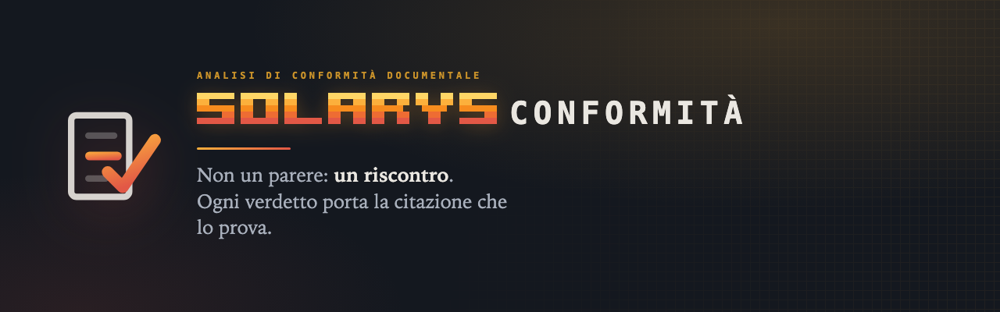
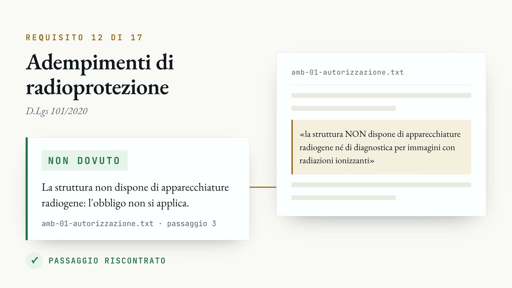
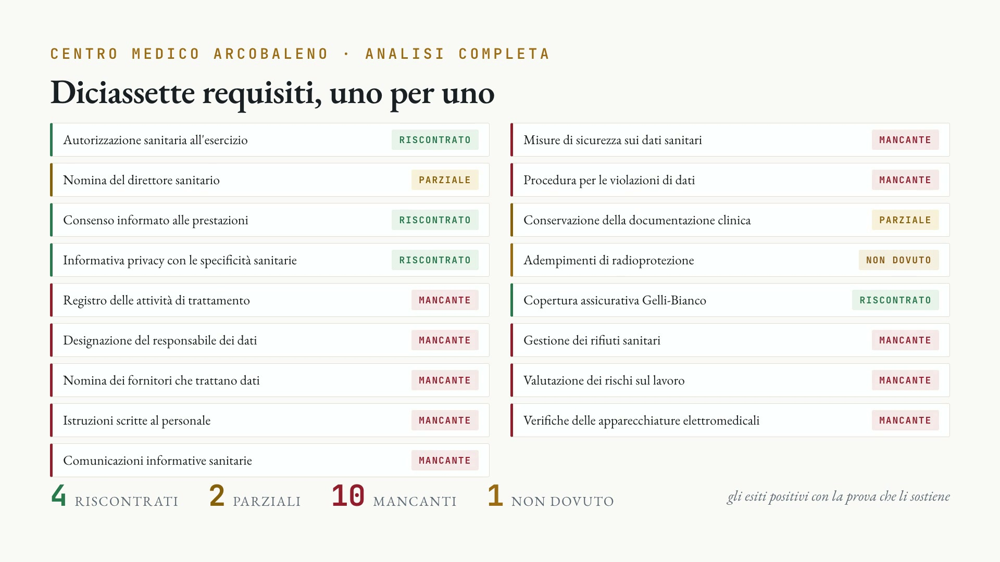
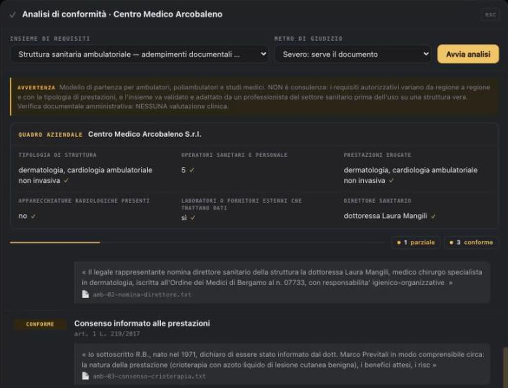
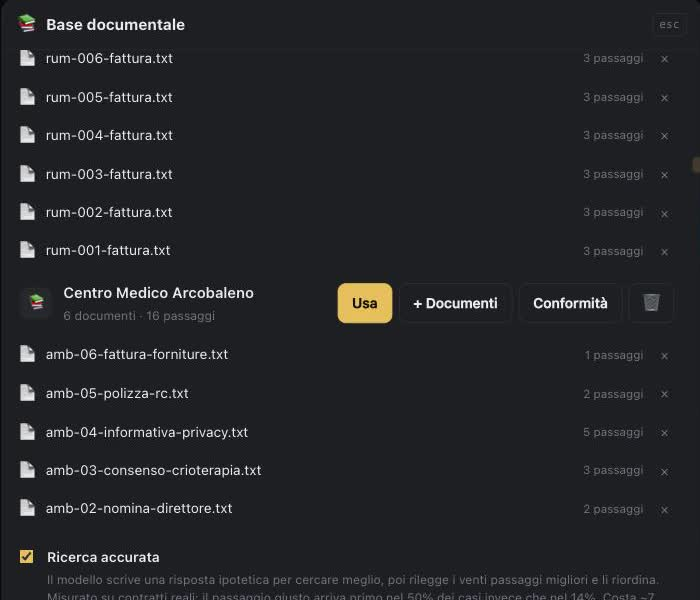

[Live landing page](https://solarys431.github.io/solarys-conformita-sito/) ·
[Italiano](README.md) · **English**

**Functional prototype for local, requirement-by-requirement document pre-audits.**

Public prototype version: **v0.1.0**.

It reads a client's documents — corporate records, procedures, appointments,
insurance policies, minutes, and risk assessments — compares them with versioned
documentary requirements, and produces a working report that distinguishes present,
partial, missing, and review-required evidence.

In its local configuration, it runs on the professional firm's computer: documents
and prompts are not sent to cloud services, and analysis can run offline after the
models have been installed.

---

## Not an opinion: an evidence check

Findings based on positive evidence include a quotation checked against the original
document. If the passage cannot be confirmed, the finding is blocked and sent for
review; missing evidence remains explicitly identified as missing.

For example, when asked whether a synthetic outpatient clinic must comply with
radiation-protection obligations, a 23 GB language model answers **“Yes, it is
mandatory”**, lists the required actions and mentions criminal penalties. The answer
is wrong and cites no document.

The correct outcome is **not applicable**, supported by the evidence:

> “The facility does NOT use radiogenic equipment or diagnostic imaging involving
> ionising radiation.”

Model size is not the decisive factor: the control performed after generation is.

---

## A seventeen-requirement healthcare pre-audit

The analysis runs while the professional continues working. At the end, the working
report collects findings, quotations, and calculated deadlines. Performing the same
check manually means reopening many documents and reconstructing each requirement
again whenever the file changes.

---

## The prototype at work

Findings appear as analysis progresses, with the relevant rule, reasoning, and — when
required — textual evidence. Selecting a quotation opens the source document. The
company profile records activities, staff, appointments, and equipment only when their
provenance is confirmed; conflicting facts are quarantined.

Each client has a separate collection indexed on the firm's computer. The local setup
does not require API keys or per-token usage charges; hardware, energy, maintenance,
and professional-review costs still apply.

---

## At a glance

| | |
|---|---|
| **104 requirements in seven rulebooks** | outpatient healthcare, AML (firm controls and client files), law firms, workplace safety, GDPR, and Legislative Decree 231 controls |
| **Analysis time** | depends on the model, hardware, and document volume |
| **Local configuration** | documents and prompts remain on-device during analysis |
| **Intended users** | accountants, lawyers, employment consultants, medical directors, quality managers, and small businesses |

---

## Important notice

The files shown in the examples — “Centro Medico Arcobaleno”, “Studio Legale
Ferrario”, and “Studio Bianchi” — are synthetic, including every person named in them.
They demonstrate system behaviour and do not describe real organisations or people.

The prototype performs an administrative document pre-audit. It is not legal advice,
does not assess clinical decisions, and does not replace professional judgement. The
responsible professional remains solely accountable for validating and signing the
report.

---

© 2026 Daniele Cappello. All rights reserved.

The code and materials are publicly viewable but are not distributed under an open
source licence. See [`LICENSE`](LICENSE).

[Privacy notice](privacy.html) · [Accessibility statement](accessibilita.html)
